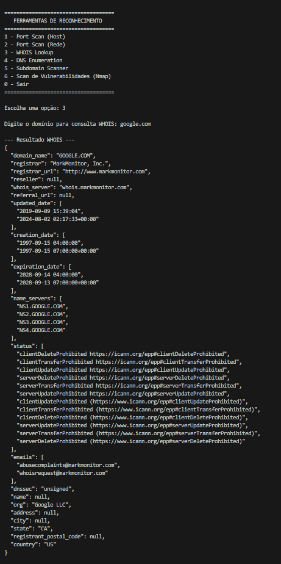
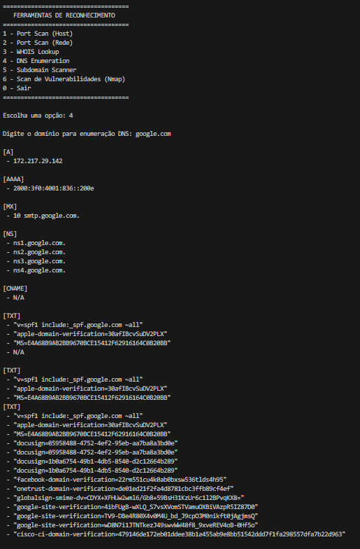
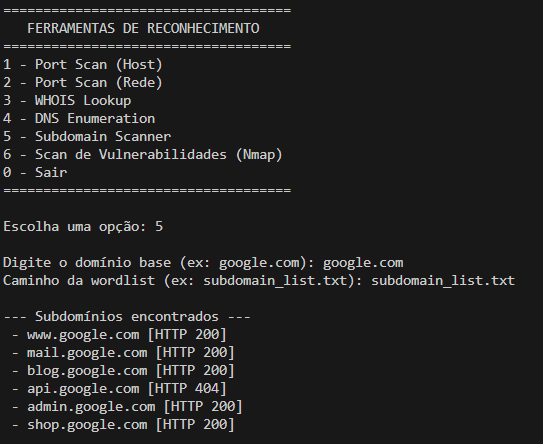

# Reconhecimento de Alvo - Roteiro 2

## Respostas às Questões de Pesquisa

1. Além do PortScan, quais são as 5 ferramentas mais úteis para reconhecimento em um pentest?

2. Qual a diferença entre um scanner de portas SYN e um TCP Connect Scan?

3. Como um pentester pode evitar ser detectado por sistemas de prevenção de intrusão (IPS) durante o reconhecimento?

---

## Descrição da Arquitetura e Decisões de Design

O projeto foi estruturado de forma modular para facilitar a manutenção e adição de novas ferramentas no futuro. Cada funcionalidade principal está em um arquivo separado que pode ser reutilizado pelo menu principal, `main.py`.

Arquivos principais:

- `main.py`: Interface principal do usuário com menus de navegação.
- `portscanner.py`: Código do PortScan desenvolvido no Roteiro 1.
- `whois_lookup.py`: Consulta WHOIS.
- `dns_enum.py`: Enumeração de registros DNS.
- `subdomain_scanner.py`: Scanner de subdomínios com wordlist.
- `vuln_scan_nmap.py`: Scan de vulnerabilidades usando Nmap.
- `subdomain_list.txt`: Lista de subdominios para testes do `subdomain_scanner.py`.

---

## Análise das Ferramentas Integradas

1. **Port Scanner (TCP/UDP)**

   - Técnica básica e essencial de coleta de informações sobre serviços em execução.
2. **WHOIS Lookup**

   - Permite obter informações do registrante de um domínio.
   - Compatível com Windows (via biblioteca `python-whois`).
3. **DNS Enumeration**

   - Identifica registros DNS importantes como MX, NS, A, entre outros.
   - Compatível com Windows (`dnspython`).
4. **Subdomain Scanner**

   - Descobre subdomínios existentes usando tentativa e erro com um arquivo txt, com todos subdomínios que o usuário quiser testar.
   - Compatível com Windows (`requests`).
5. **Vulnerability Scan (Nmap)**

   - Utiliza `nmap` com scripts NSE para identificar vulnerabilidades conhecidas.
   - Requer Linux/Kali com Nmap instalado.

---

## Documentação Técnica e Manual do Usuário

### Requisitos

- Instalar dependências com:

```bash
pip install requests dnspython python-whoi
```

- Para usar `vuln_scan_nmap.py`, o `nmap` deve estar instalado no sistema (Linux/Kali).

### Execução

Execute o sistema principal com:

```bash
python main.py
```

Siga o menu interativo e selecione a ferramenta desejada. As entradas são feitas diretamente via terminal/console.

---

## Resultados dos Testes

### Whois



### DNS Enumeration



### Subdomain Scanner



### Scan de Vulnerabilidade (Nmap)

